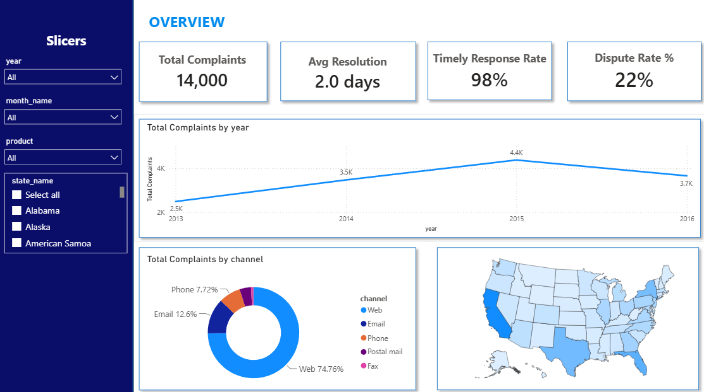
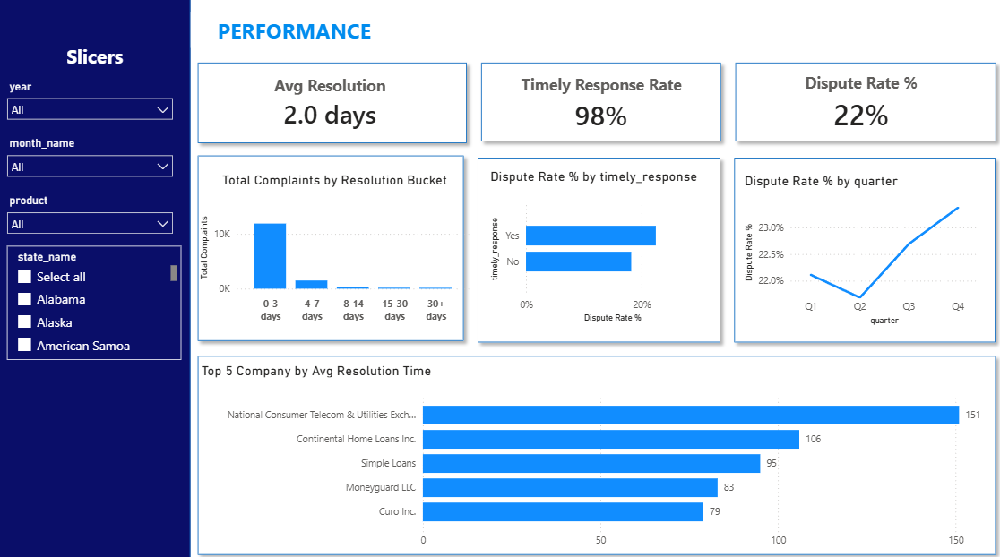
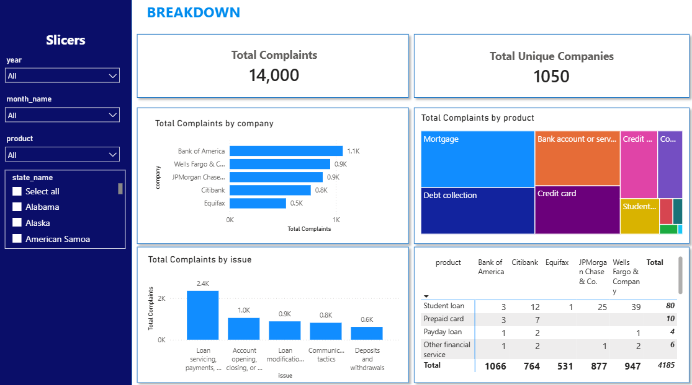

# Consumer Complaints Analysis

## 1. Introduction

**Consumer Complaints Analysis** là dự án phân tích dữ liệu cá nhân, xây dựng quy trình **ETL (Extract – Transform – Load)** hoàn chỉnh từ raw CSV đến dashboard Power BI, nhằm minh họa quy trình làm việc thực tế của một Data Analyst.

Dự án xử lý bộ dữ liệu ~14,000 khiếu nại của người tiêu dùng đối với các công ty tài chính (ngân hàng, cho vay, thẻ tín dụng...), làm sạch dữ liệu thô còn nhiều lỗi định dạng, mô hình hóa theo Star Schema trong PostgreSQL, rồi trực quan hóa trên Power BI. Kết quả nổi bật nhất: dù công ty xử lý khiếu nại rất nhanh (đa số trong 0-3 ngày) và gần như luôn đúng hạn (98%), tỷ lệ khách hàng dispute vẫn duy trì ổn định quanh 22% — cho thấy tốc độ xử lý không phải là yếu tố quyết định sự hài lòng của khách hàng.

### Mục lục
- [2. Business Context & Core Problem](#2-business-context--core-problem)
- [3. Background](#3-background)
- [4. Tools I Used](#4-tools-i-used)
- [5. Analysis](#5-analysis)
- [6. Insights](#6-insights)
- [7. Conclusion & Recommendations](#7-conclusion--recommendations)
- [8. Project Structure](#8-project-structure)

---

## 2. Business Context & Core Problem

**Context:**
Trong ngành dịch vụ tài chính (ngân hàng, cho vay, thẻ tín dụng, tín dụng tiêu dùng...), khiếu nại của khách hàng là chỉ báo trực tiếp cho chất lượng dịch vụ và mức độ tuân thủ quy định. Các công ty thường đo lường hiệu quả xử lý khiếu nại qua 2 chỉ số phổ biến: **tốc độ xử lý** (resolution time) và **tỷ lệ đúng hạn** (timely response rate) — với giả định ngầm rằng xử lý nhanh và đúng hạn sẽ giúp giảm bất mãn của khách hàng.

**Core Problem:**
Giả định trên có thực sự đúng không? Dự án này đặt câu hỏi: *liệu tốc độ và tính đúng hạn trong xử lý khiếu nại có thực sự tương quan với việc giảm tỷ lệ khách hàng dispute (không đồng ý với cách giải quyết) hay không?* Đây là câu hỏi cốt lõi mà toàn bộ phân tích hướng tới trả lời.

---

## 3. Background

**Mô tả Dataset:**

| Thuộc tính | Chi tiết |
|---|---|
| Nguồn | File CSV `consumer_complaints` |
| Số dòng | ~14,000 complaints |
| Số cột gốc | 16 cột |
| Phạm vi thời gian | 2013 – 2016 |
| Các trường chính | Company, Product, Issue, State, Submitted via (channel), Date received, Date resolved, Timely response?, Consumer disputed?, Resolution time (days) |

---

## 4. Tools I Used

- **PostgreSQL** — database chính, thực hiện toàn bộ cleaning, transformation và modeling
- **VS Code + SQLTools extension** — viết và chạy SQL trực tiếp
- **Power BI Desktop** — kết nối trực tiếp tới PostgreSQL, xây dựng data model và dashboard
- **Markdown** — ghi log chi tiết quá trình cleaning (`cleaning_data_log.md`, `create_star_log.md`) để đảm bảo khả năng truy vết (traceability) mọi thao tác trên dữ liệu
- **Git & GitHub:** Dùng để quản lý phiên bản (version control) và đóng gói toàn bộ dự án thành một portfolio có thể chia sẻ công khai.

---

## 5. Analysis

Quy trình phân tích được chia thành 4 giai đoạn chính:

### 5.1. Data Cleaning (PostgreSQL)

**Các vấn đề chất lượng dữ liệu phát hiện khi import:**
- File có BOM (Byte Order Mark) ở đầu tên cột đầu tiên
- Cặp cột trùng lặp: `Date received`/`Date resolved` xuất hiện 2 lần (`.1` và `.2`)
- Định dạng ngày tháng không nhất quán do Excel tự động parse locale-based, gây đảo ngược ngày/tháng (MM/DD ↔ DD/MM) ở nhiều dòng
- Giá trị NULL và `#N/A` rải rác ở cột `state`/`state_name`

**Các thao tác xử lý:**
- Xóa cột trùng lặp, chuẩn hóa tên cột
- Chuyển đổi kiểu dữ liệu ngày tháng từ VARCHAR sang DATE
- Phát hiện và fix lỗi swap ngày/tháng: dùng CTE phân loại 4 trường hợp (khớp gốc / swap received / swap resolved / swap cả hai) đối chiếu ngược với `resolution_time_days` để xác định giá trị đúng, dùng `MAKE_DATE` để sửa theo đúng combo khớp
- Xử lý NULL/#N/A ở cặp `state`/`state_name`: chuẩn hóa 110 dòng thiếu cả 2 giá trị thành `'UNKNOWN'`, điền 47 dòng thiếu `state_name` qua JOIN với danh sách mã bang chuẩn
- Kiểm tra và xác nhận không có duplicate hệ thống (dựa trên `id` unique 100%)

### 5.2. Star Schema Modeling (PostgreSQL)
Xây dựng mô hình Fact – Dimension gồm:
- **Fact table**: `consumer_complaints` (qua view `consumer_complaints_ordered`)
- **7 Dimension tables**: `dim_date`, `dim_company`, `dim_product`, `dim_issue`, `dim_state`, `dim_channel`, `dim_response_flag`

Điểm kỹ thuật đáng chú ý: `dim_date` phải được tạo lại bằng `GENERATE_SERIES` để đảm bảo dải ngày liên tục (không có gap) — yêu cầu bắt buộc để Power BI cho phép đánh dấu "Date table" và sử dụng các hàm Time Intelligence. `date_received` và `date_resolved` cùng tham chiếu tới `dim_date`, xử lý bằng kỹ thuật **role-playing dimension** (1 quan hệ active, 1 quan hệ inactive dùng `USERELATIONSHIP`) để phân tích được cả góc độ "nhận" và "xử lý xong".

### 5.3. Power BI — Data Modeling
- Thiết lập lại toàn bộ relationship giữa fact và 7 dimension (FK ở tầng PostgreSQL không tự chuyển thành relationship trong Power BI model)
- Xây dựng lớp Measures (DAX) tách riêng trong bảng `_Measures`, bao gồm: `Total Complaints (Received)`, `Total Complaints (Resolved)`, `Avg Resolution Days`, `Dispute Rate %`, `Timely Response Rate %`, `Total Unique Companies`, `Complaints for Map`, và calculated column `Resolution Bucket` để phân nhóm thời gian xử lý

### 5.4. Dashboard Development (Power BI)
Dashboard gồm 3 trang, mỗi trang trả lời 1 câu hỏi phân tích riêng biệt:
- **Overview** — quy mô tổng thể, xu hướng theo thời gian, phân bố kênh và địa lý
- **Performance** — tốc độ xử lý, tỷ lệ đúng hạn, tỷ lệ dispute và mối quan hệ giữa chúng
- **Breakdown** — phân tích theo company/product/issue để xác định nguồn gốc vấn đề

> **Lưu ý:** Do giới hạn tài khoản (không thể Publish lên Power BI Service ở chế độ chia sẻ công khai), dashboard được đính kèm dưới dạng ảnh chụp màn hình cho từng trang bên dưới. Link xem trực tiếp (tương tác được, có thể tải): [Dashboard trên Power BI](datatset_consumer_complaints.pbix)

**Trang 1 — Overview**

<!-- Dán ảnh chụp Trang 1 Overview vào đây -->


**Trang 2 — Performance**

<!-- Dán ảnh chụp Trang 2 Performance vào đây -->


**Trang 3 — Breakdown**

<!-- Dán ảnh chụp Trang 3 Breakdown vào đây -->


---

## 6. Insights

- **Insight 1 — Tốc độ xử lý không quyết định sự hài lòng của khách hàng:** Gần như 100% khiếu nại được xử lý trong 0-3 ngày, và 98% được xử lý đúng hạn. Tuy nhiên, tỷ lệ dispute giữ nguyên ổn định quanh 22% bất kể nhóm timely hay không (22.5% ở nhóm đúng hạn vs 18.2% ở nhóm trễ hạn, trên tổng 3,138/14,000 dòng dispute) — cho thấy tốc độ xử lý và tính đúng hạn không phải là yếu tố chính ảnh hưởng đến việc khách hàng có dispute hay không.

- **Insight 2 — Xu hướng complaint tăng dần 2013-2015 rồi giảm nhẹ 2016:** Số lượng khiếu nại tăng liên tục từ 2013 đến đỉnh vào 2015, sau đó giảm nhẹ trong 2016.

- **Insight 3 — Kênh Web chiếm ưu thế tuyệt đối:** 74.76% khiếu nại được gửi qua kênh Web, bỏ xa các kênh còn lại (Email, Phone, Postal mail, Fax).

- **Insight 4 — Complaint tập trung ở các bang đông dân:** California, Texas, Florida có số lượng complaint cao nhất — phù hợp với quy mô dân số, không nhất thiết phản ánh chất lượng dịch vụ kém hơn ở các bang này (cần chuẩn hóa theo đầu người nếu muốn so sánh công bằng).

- **Insight 5 — Phân bố complaint theo company có dạng long-tail:** Một số ít công ty lớn (Bank of America, Wells Fargo, JPMorgan Chase...) chiếm tỷ trọng lớn, trong khi phần lớn trong tổng 1,050 công ty chỉ có 1-2 complaint.

- **Insight 6 — "Loan servicing, payments" là loại issue phổ biến nhất**, phù hợp với đặc điểm ngành của các công ty trong dataset (chủ yếu là tổ chức tài chính/cho vay).

---

## 7. Conclusion & Recommendations

**Conclusion:**
Phân tích cho thấy các công ty trong dataset đã đạt hiệu suất vận hành cao ở khía cạnh tốc độ (resolution time) và tuân thủ hạn xử lý (timely response) — cả 2 chỉ số đều gần chạm mức trần lý tưởng. Tuy nhiên, tỷ lệ khách hàng dispute vẫn duy trì ở mức đáng kể (~22%) và không cải thiện tương ứng với tốc độ xử lý nhanh. Điều này gợi ý rằng nguyên nhân gốc rễ của sự bất mãn khách hàng nằm ở **chất lượng của cách giải quyết** (VD: có giải quyết đúng vấn đề khách nêu, có đền bù/hoàn tiền thỏa đáng...) chứ không phải ở tốc độ phản hồi — một khía cạnh mà dataset hiện tại không đo lường trực tiếp được.

**Lưu ý về giới hạn dữ liệu:** Nhóm "trễ hạn" (timely_response = No) chỉ chiếm 225/14,000 dòng (1.6%), cỡ mẫu nhỏ khiến so sánh giữa 2 nhóm có độ tin cậy thống kê hạn chế — kết luận về sự khác biệt giữa nhóm đúng hạn/trễ hạn cần được diễn giải thận trọng.

**Recommendation:**

*Short-term:*
- Bổ sung thu thập dữ liệu định tính (VD: lý do dispute cụ thể, mức độ hài lòng qua khảo sát sau xử lý) để xác định chính xác nguyên nhân gây dispute, thay vì chỉ dựa vào tốc độ/thời hạn
- Ưu tiên rà soát quy trình xử lý tại nhóm công ty có Avg Resolution Time cao nhất (Top 5 xác định ở trang Performance) — dù chưa chắc liên quan trực tiếp đến dispute, đây vẫn là điểm nghẽn vận hành cần cải thiện

*Long-term:*
- Xây dựng thêm chỉ số đo lường "chất lượng giải quyết" (resolution quality) độc lập với tốc độ, làm cơ sở đánh giá toàn diện hơn
- Theo dõi dispute rate theo thời gian ở cấp độ công ty/product để phát hiện sớm các nhóm có xu hướng xấu đi, thay vì chỉ nhìn tổng thể

---

## 8. Project Structure

```
consumer-complaints-analysis/
├── .vscode/
├── csv_file/
│   ├── datatset_consumer_complaints.csv    # Raw dataset gốc
├── picture/                                # Chứa ảnh chụp
├── sql_file/
│   ├── 1.Cleaning_Data.sql                 # Script làm sạch dữ liệu (date fix, NULL handling, dim_state)
│   ├── 2.Create_Star_Schema.sql            # Script tạo Star Schema (7 dimension tables + fact table)
│   ├── cleaning_data_log.md                # Log chi tiết từng bước cleaning
│   └── create_star_log.md                  # Log chi tiết từng bước tạo Star Schema
├── sql_load/                               # Step import file csv
│   ├── 1_create_database.sql
│   ├── 2.create_table.sql
│   └── 3_modify_tables.sql
├── datatset_consumer_complaints.pbix       # File Power BI dashboard (3 trang)
└── README.md                               # File này
```

**Hướng dẫn chạy lại project:**
1. Import `datatset_consumer_complaints.csv` vào PostgreSQL và làm theo thứ tự trong `sql_load`
2. Chạy `1_Cleaning_Data.sql` theo đúng thứ tự transaction (BEGIN/COMMIT) đã đánh dấu
3. Chạy `2_Create_Star_Schema.sql` để tạo toàn bộ dimension/fact table
4. Tải + Mở `datatset_consumer_complaints.pbix` bằng Power BI Desktop